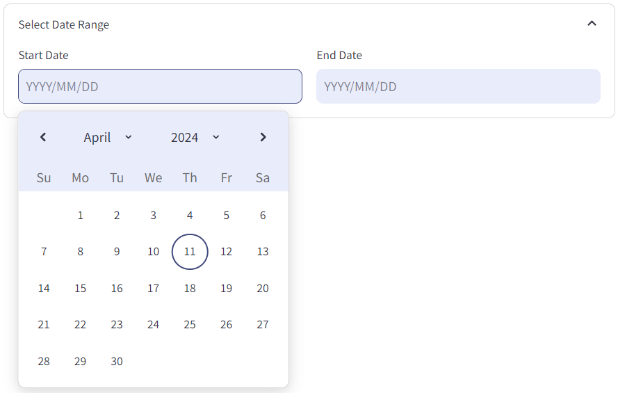

# Analytics Dashboard

See how your business is performing and make informed decisions.

## Time Range Selection

You can customise the analytics view by selecting a specific time frame. You have the flexibility to either manually enter dates in YYYY/MM/DD format or use the calendar.

    

## Insights and Visualisations
Gain valuable insights into your business performance through various analytics.

### Metrics:
- **Total Sales:** Track overall sales performance.
- **Average Transaction Value:** Understand the average value of each transaction.
- **Average Quantity Per Product:** Analyse the average quantity sold per product.
- **Average Daily Transactions:** Monitor the average number of transactions per day.
- **Units Per Transaction:** Examine the number of units sold per transaction.

### Charts:
- **Sales and Quantity by Category:** Visualise sales and quantity distribution across different categories using a Grouped Bar Chart.
- **Sales and Quantity by Product:** Analyse sales and quantity distribution by product with a Horizontal Stacked Bar Chart.
- **Cumulative Daily Sales Over Time:** Track cumulative sales over time with a Line Graph.
- **Total Daily Sales Over Time:** Monitor daily sales trends with a Line Graph.
- **Total Sales by Day of Week:** Understand sales patterns based on the day of the week using a Bar Chart.
- **Number of Daily Transactions:** Track the number of daily transactions over time with a Line Graph.
- **Expenses by Category:** Visualise expense distribution across different categories using a Pie Chart.
- **Total Daily Expenses Over Time:** Monitor daily expenses trends with a Line Graph.
- **Total Daily Expenses By Day of Week:** Understand expense patterns based on the day of the week using a Bar Chart.

## Interactive Visualisation

Want to analyse futher? With our interactive feature, you can:

- **Filter Categories:** Select specific categories to focus on in your charts.
- **Adjust Traces:** Customise which data points you want to visualise by toggling traces on and off.
- **Hover Over Data Points:** Gain instant insights by hovering over data points to view detailed information, such as exact values or labels, directly on the charts.