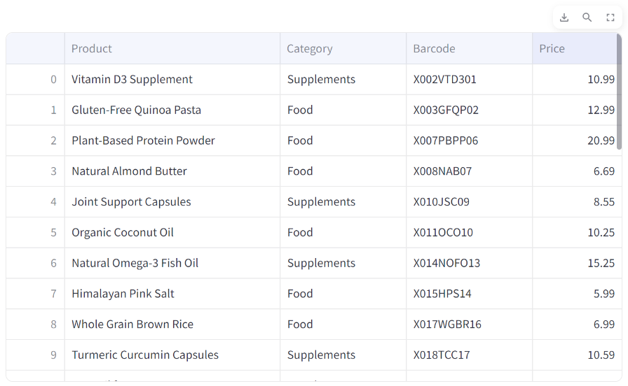

# Product Management

Change the way you mange your products with the intuitive features of SaleSights.

## Product Table

The product table acts as your central hub for all product-related information, including Product Name, Category, Barcode, and Price. Take control with the ability to:

- **Sort Columns:** Arrange data in ascending or descending order by simply clicking on the column headers.
- **Search Functionality:** Easily find specific things within the table for quick access.
- **CSV Download:** Export your product table for external use effortlessly.

    

## Updating Products & Product Categories

Effortlessly manage your products with SaleSights, offering a hassle-free process for adding, editing, or deleting both products and product categories.

### Add, Edit, or Delete with Ease

Whether you're introducing new products, refining existing details, or removing outdated entries, SaleSights simplifies the process. Enjoy the flexibility to:

- **Add and Deleting Products:** Add or remove items to your inventory effortlessly.
- **Edit Details:** Easily modify product information or update product categories as your business evolves.

## Things to Note!

> When a category is deleted, SaleSights intelligently handles the transition. All products associated with the deleted category are automatically reassigned to a new category called 'Other.' This ensures continuity in your inventory management.

> The barcode field is optional, providing flexibility for your unique needs.

