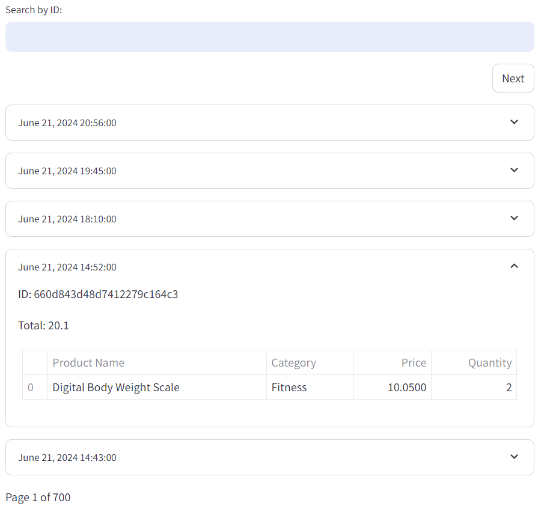

# View Transaction & Expense History
View Past Transactions and Expenses with ease. They are listed in chronological order.

    

## Search
You can search for transactions or expenses using their ID. This is useful when specific transaction details need to be quickly retrieved or when the integrity of a transaction or receipt needs to be verified.

## Things to Note

> The expense history can be viewed in the expense service while the transaction history can be viewed in the transactions service.